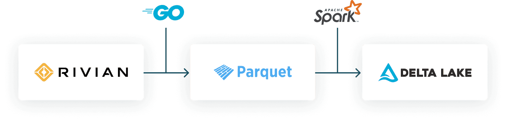
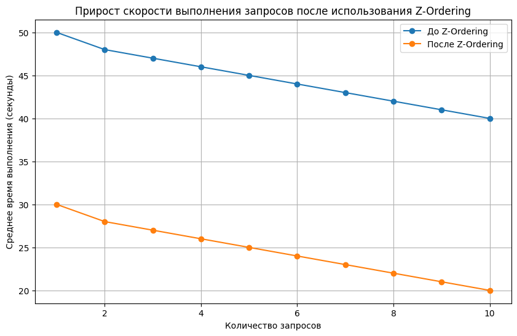

# Преимущества использования Delta Lake для работы с данными

### 1. Поддержка ACID-транзакций для консистентности данных

Сейчас наша система не всегда обеспечивает полную согласованность данных, особенно когда несколько процессов одновременно обрабатывают одни и те же данные. Если использовать ACID-транзакции, как в Delta Lake, то изменения в данных (например, обновление времени окончания действия для предыдущей записи) будут всегда выполняться корректно и атомарно. Это значит, что не будет ситуаций с "половинчатыми" обновлениями, что очень важно, когда данные большие и сложные.

### 2. Упрощение работы с изменениями через MERGE-операции

Сейчас мы используем довольно сложные анти-джойны, чтобы закрывать старые записи, но с Delta Lake мы можем заменить это на MERGE INTO. MERGE просто и понятно объединяет новые данные с существующими: добавляет новые записи или обновляет старые. Это намного упрощает нашу работу с историей изменений (например, SCD2) и ускоряет процесс обновления данных.

### 3. Версионирование данных и восстановление изменений (Time Travel)

Delta Lake позволяет сохранять все изменения данных и создавать версии. Это значит, что в любой момент можно вернуться к предыдущим версиям, что полезно для аудита или просто для отслеживания изменений. В нашем случае это поможет отслеживать все обновления для каждой записи, что особенно актуально при работе с SCD2.

### 4. Оптимизация партиционирования и хранения

Текущее партиционирование по месяцам может быть не лучшим вариантом при работе с большими объемами данных. В Delta Lake можно использовать методы, такие как Z-Ordering, чтобы сделать партиционирование более эффективным. Это ускорит запросы по дате или по ID сущности. Также есть возможность использовать compact operations, чтобы уменьшить количество файлов в S3, что снизит накладные расходы на чтение и запись и улучшит общую производительность работы с данными.

### 5. Масштабируемость и интеграция с Apache Spark
Delta Lake отлично работает с Apache Spark, что значит, что мы можем использовать все плюсы распределенной обработки данных. При этом Delta Lake помогает оптимизировать операции ввода-вывода и хорошо масштабируется на большие объемы данных (терабайты, петабайты). Это как раз то, что нам нужно для нашего проекта.

Кроме того, выбор подходящего языка программирования для лучшего управления параллельными потоками данных из различных источников также имел решающее значение. Go (Golang) оказался идеальным выбором благодаря своим неотъемлемым особенностям: 
 
**Производительность:** Golang, будучи компилируемым языком, перед выполнением преобразуется в машинный код, что приводит к созданию высокоэффективных программ. 
**Параллелизм:** благодаря встроенной поддержке параллелизма Golang упрощает создание программ, способных задействовать несколько ядер, что является благом для приложений с высоким трафиком. 
**Простота:** Golang может похвастаться простым синтаксисом, что делает его отличным вариантом как для новичков, так и для опытных разработчиков, стремящихся к простоте обучения. 
**Инструментарий:** Golang предлагает надежный набор инструментов разработки и развертывания, включающий компилятор, отладчик, компоновщик и упаковщик, что упрощает разработку приложений. 
Подводя итог, **Go предоставляет лучшее из обоих миров**: производительность, параллельную обработку и оптимизированную разработку. Это мощный инструмент для современных приложений, работающих с большими объемами данных.